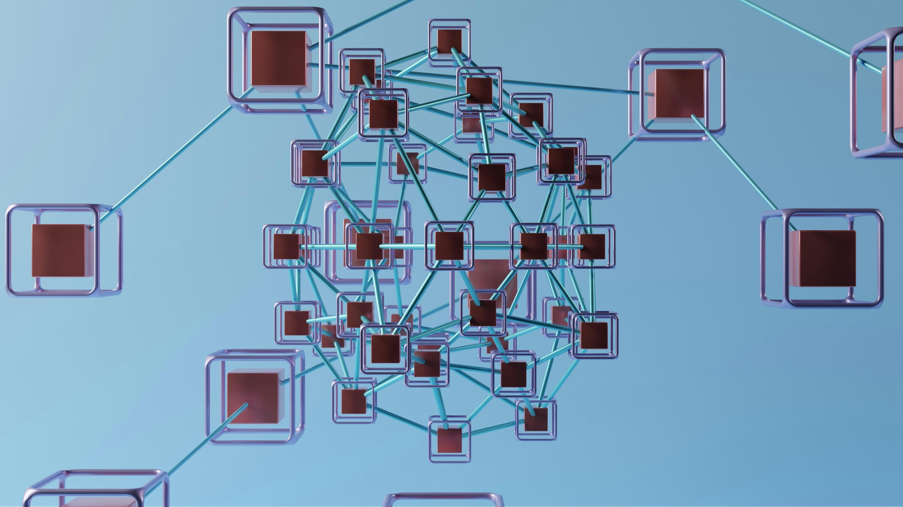
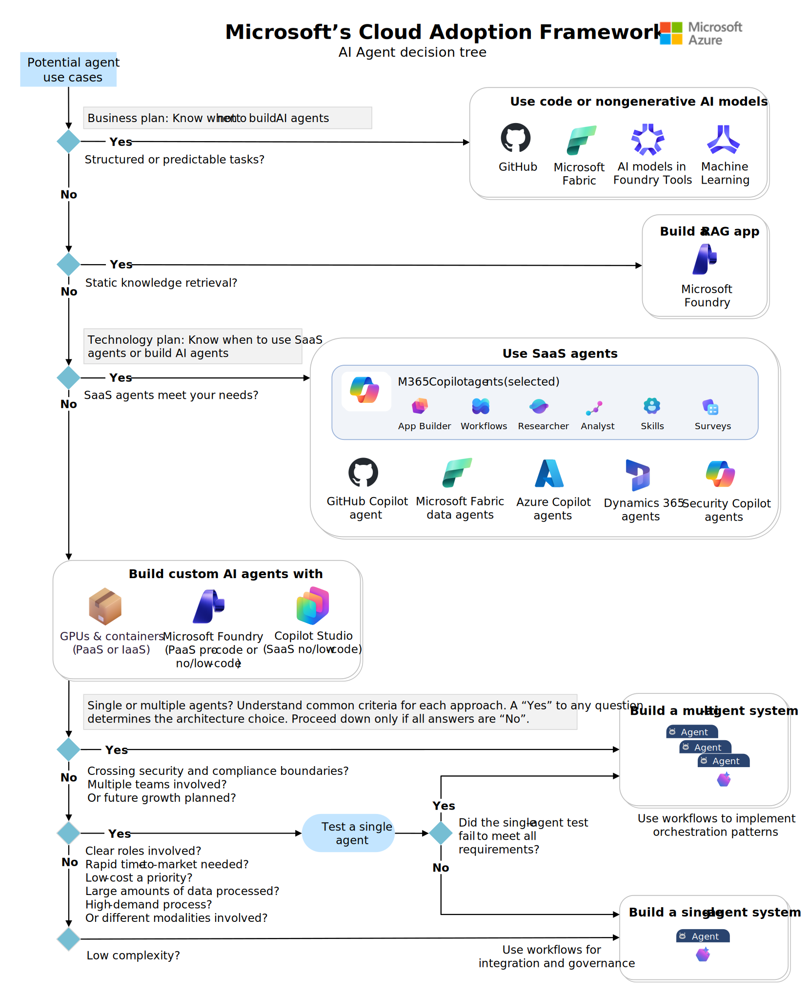

# Enterprise-Grade Natural Language to SQL Generation using LLMs (NL2SQL)

Photo by <a href="https://unsplash.com/@guerrillabuzz?utm_source=unsplash&utm_medium=referral&utm_content=creditCopyText">GuerrillaBuzz</a> on <a href="https://unsplash.com/photos/diagram-7hA2wqBcSF8?utm_source=unsplash&utm_medium=referral&utm_content=creditCopyText">Unsplash</a>

The Natural Language to SQL project leverages Azure Generative AI to automatically create SQL queries from natural language inputs. This approach streamlines the conversion process, helping to ensure both accuracy and efficiency. When building NL to SQL solutions, here are the key issues to address:

* **Schema Complexity**: Databases have intricate schemas that can make NL to SQL translation difficult.
* **Schema Storage & Planning**: Efficiently storing schema details for quick access by the AI model.
* **Contextual Retrieval**: The AI model requires an understanding of schema relationships to generate accurate queries.
* **Ranking and Optimization**: Retrieving the most relevant schema details and prioritizing them for accuracy.
* **Natural Language Ambiguity**: Human language is inherently ambiguous and context-dependent. Disambiguating user queries and understanding the intended meaning is necessary to generate accurate SQL statements.
* **Dynamic Schemas**: Adapting to evolving database schemas without much challenge is crucial.

# Technology Plan for AI Agents

It's critical to understand how to select the right technology platform for each of your potential agent use cases. It covers adopting a ready-to-use SaaS agent or building a custom agent with Microsoft Foundry (PaaS) or Microsoft Copilot Studio (SaaS). Effective technology adoption aligns goals with cost, level of effort, and customization needs. This alignment matches the technology to the use case and balances the effort required to achieve a return on investment. Understanding the available landscape ensures the right choice between adopting a ready-to-use SaaS agent or building a custom solution to provide business advantage.

## AI Agent Decision Tree

The AI agent decision tree guides the technology selection process by focusing on one primary question: Does a SaaS agent meet your functional requirements? If a SaaS agent satisfies your needs, adopt the prebuilt solution. If no SaaS agent fits the use case, you must build a custom agent. Determining which platform to use for a custom build, Microsoft Foundry, Microsoft Copilot Studio, or custom infrastructure, requires further investigation. The following sections provide guidance on selecting the right platform based on your specific requirements.

# Additional Resources

1. [Technology Plan for AI Agents across your organization using the Microsoft Ecosystem - Cloud Adoption Framework | Microsoft Learn](https://learn.microsoft.com/en-us/azure/cloud-adoption-framework/ai-agents/technology-solutions-plan-strategy)