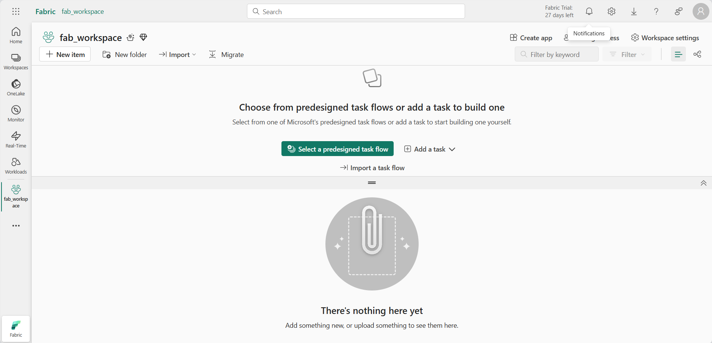

- [Chat with your data using Microsoft Fabric data agents](#chat-with-your-data-using-microsoft-fabric-data-agents)
  - [What you’ll learn](#what-youll-learn)
  - [Before you start](#before-you-start)
  - [Exercise scenario](#exercise-scenario)
  - [Create a workspace](#create-a-workspace)
  - [Addtional Resources](#addtional-resources)

# Chat with your data using Microsoft Fabric data agents

A Microsoft Fabric data agent enables natural interaction with your data by allowing you to ask questions in plain English and receive structured, human-readable responses. By eliminating the need to understand query languages like SQL (Structured Query Language), DAX (Data Analysis Expressions), or KQL (Kusto Query Language), the data agent makes data insights accessible across the organization, regardless of technical skill level.

This exercise should take approximately less than **10** minutes to complete.

## What you’ll learn

By completing this lab, you will:

* Understand the purpose and benefits of Microsoft Fabric data agents for natural language data analysis.
* Learn how to create and configure a Fabric workspace and data warehouse.
* Gain hands-on experience loading and exploring a star schema sales dataset.
* See how data agents translate plain English questions into SQL queries.
* Develop skills to ask effective analytical questions and interpret AI-generated results.
* Build confidence in leveraging AI tools to democratize data access and insights.

## Before you start

You need a **Microsoft Fabric Capacity (F2 or higher)** with Copilot enabled to complete this exercise.

## Exercise scenario

We will create a sales data warehouse, load some data into it and then create a Fabric data agent. We will then ask it a variety of questions and explore how the data agent translates natural language into SQL queries to provide insights. This hands-on approach will demonstrate the power of AI-assisted data analysis without requiring deep SQL knowledge. Let’s start!

## Create a workspace

Before working with data in Fabric, create a workspace with Fabric enabled. A workspace in Microsoft Fabric serves as a collaborative environment where you can organize and manage all your data engineering artifacts including lakehouses, notebooks, and datasets. Think of it as a project folder that contains all the resources needed for your data analysis.

1. Navigate to the Microsoft Fabric home page at https://app.fabric.microsoft.com/home?experience=fabric in a browser, and sign in with your Fabric credentials.

2. In the menu bar on the left, select Workspaces (the icon looks similar to 🗇).

3. Create a new workspace with a name of your choice, selecting a licensing mode that includes Fabric capacity (Premium, or Fabric). Note that Trial is not supported.

> **Why this matters:** Copilot requires a paid Fabric capacity to function. This ensures you have access to the AI-powered features that will help generate code throughout this lab.

4. When your new workspace opens, it should be empty.

## Addtional Resources

- [Enable Copilot in Fabric - Microsoft Fabric | Microsoft Learn](https://learn.microsoft.com/en-us/fabric/fundamentals/copilot-enable-fabric)
- [Fabric data agent scenario (preview) - Microsoft Fabric | Microsoft Learn](https://learn.microsoft.com/en-us/fabric/data-science/data-agent-end-to-end-tutorial)
- [Understand Microsoft Fabric Licenses - Microsoft Fabric | Microsoft Learn](https://learn.microsoft.com/en-us/fabric/enterprise/licenses#capacity)
