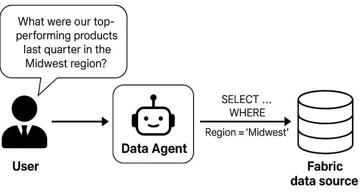
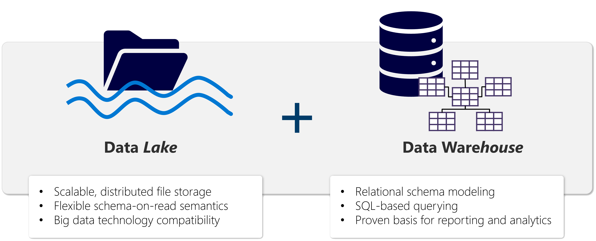
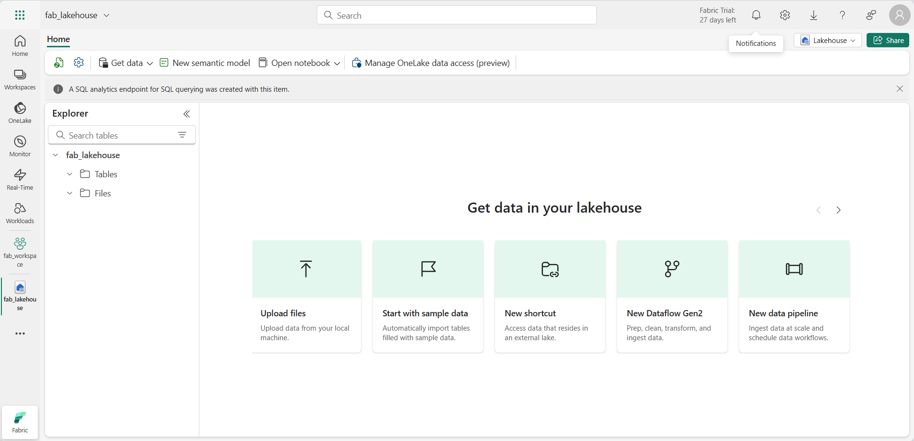
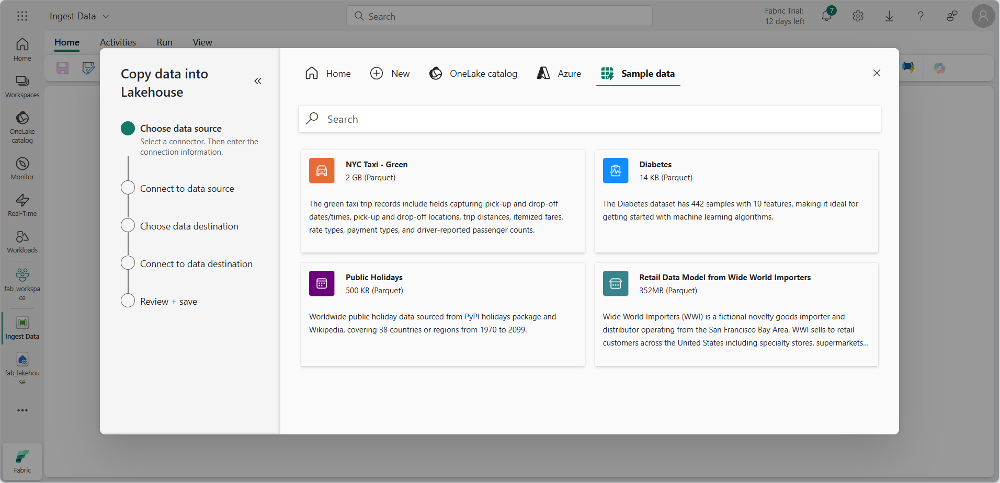
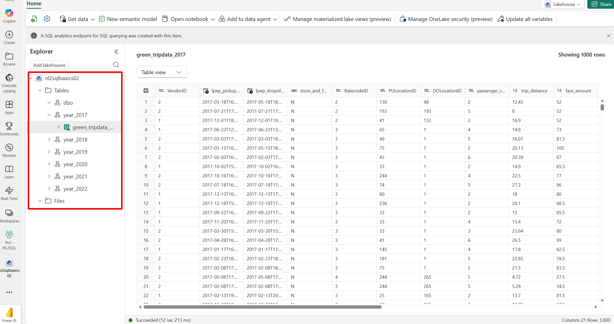
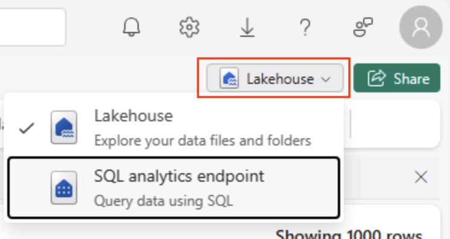
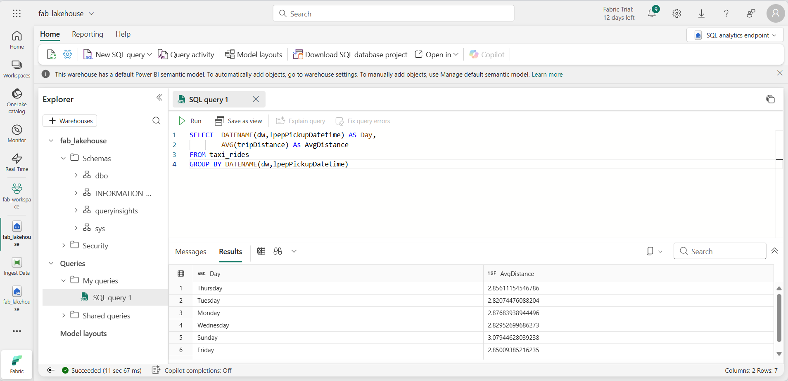

- [Chat with your data using Microsoft Fabric data agents](#chat-with-your-data-using-microsoft-fabric-data-agents)
  - [What you’ll learn](#what-youll-learn)
  - [Before you start](#before-you-start)
  - [Exercise scenario](#exercise-scenario)
  - [Get Data in Your Lakehouse](#get-data-in-your-lakehouse)
  - [Query data in a lakehouse](#query-data-in-a-lakehouse)
  - [Bonus: More SQL Queries](#bonus-more-sql-queries)
  - [Addtional Resources](#addtional-resources)


# Chat with your data using Microsoft Fabric data agents



A Microsoft Fabric data agent enables natural interaction with your data by allowing you to ask questions in plain English and receive structured, human-readable responses. By eliminating the need to understand query languages like SQL (Structured Query Language), DAX (Data Analysis Expressions), or KQL (Kusto Query Language), the data agent makes data insights accessible across the organization, regardless of technical skill level.

This exercise should take approximately less than **10** minutes to complete.

## What you’ll learn

By completing this lab, you will:

* Understand the purpose and benefits of Microsoft Fabric data agents for natural language data analysis.
* Learn how to create and configure a Fabric workspace and data warehouse.
* Gain hands-on experience loading and exploring a star schema sales dataset.
* See how data agents translate plain English questions into SQL queries.
* Develop skills to ask effective analytical questions and interpret AI-generated results.
* Build confidence in leveraging AI tools to democratize data access and insights.
* Understand Microsoft Fabric Lakehouse concepts: Learn how to create workspaces and lakehouses, which are central to organizing and managing data assets in Fabric.
* Ingest data using pipelines: Use a guided pipeline to bring external data into the lakehouse, making it query-ready without manual coding
* Explore and query data with SQL: Analyze ingested data using familiar SQL queries, gaining insights directly within Fabric.
* Manage resources: Learn best practices for cleaning up resources to avoid unnecessary charges.

## Before you start

You need a **Microsoft Fabric Capacity (F2 or higher)** with Copilot enabled to complete this exercise.

## Exercise scenario

We will create a sales data warehouse, load some data into it and then create a Fabric data agent. We will then ask it a variety of questions and explore how the data agent translates natural language into SQL queries to provide insights. This hands-on approach will demonstrate the power of AI-assisted data analysis without requiring deep SQL knowledge. Let’s start!

## Get Data in Your Lakehouse

A **lakehouse** presents as a database and is built on top of a data lake using Delta format tables. Lakehouses combine the SQL-based analytical capabilities of a relational data warehouse and the flexibility and scalability of a data lake. Lakehouses store all data formats and can be used with various analytics tools and programming languages. As cloud-based solutions, lakehouses can scale automatically and provide high availability and disaster recovery.



Some benefits of a lakehouse include:

1. Lakehouses use Spark and SQL engines to process large-scale data and support machine learning or predictive modeling analytics.
2. Lakehouse data is organized in a schema-on-read format, which means you define the schema as needed rather than having a predefined schema.
3. Lakehouses support ACID (Atomicity, Consistency, Isolation, Durability) transactions through Delta Lake formatted tables for data consistency and integrity.
4. Lakehouses are a single location for data engineers, data scientists, and data analysts to access and use data.

A lakehouse is a great option if you want a scalable analytics solution that maintains data consistency. It's important to evaluate your specific requirements to determine which solution is the best fit.

Now that you have a workspace, it’s time to create a lakehouse for your data files.





For us, consider the **NYC Taxi - Green** dataset. It contains detailed records of taxi trips in New York City, including pickup and drop-off times, locations, trip distances, fares, and passenger counts. It is widely used in data analytics and machine learning for exploring urban mobility, demand forecasting, and anomaly detection. This dataset is stored in Parquet format. There are about 80M rows (2 GB) in total as of 2018.

This dataset contains historical records accumulated from 2009 to 2018. You can use parameter settings in our SDK to fetch data within a specific time range. 

> 💡 A data dictionary is essential for NL2SQL because it helps resolve ambiguity by defining the meanings, context, and relationships of tables and columns. This allows Large Language Models (LLMs) to accurately interpret natural language, understand complex database schemas, manage different data formats (such as 'M' versus 'Male'), and connect human language to database terms. As a result, it helps generate correct and reliable SQL queries for users who may not be familiar with the database structure. **Having a proper data dictionary is always necessary for the NL2SQL agent.**

| Name                 | Data type | Unique     | Values (sample)                         | Description                                                                                                                                                                                                                                                    |
|----------------------|-----------|------------|-----------------------------------------|----------------------------------------------------------------------------------------------------------------------------------------------------------------------------------------------------------------------------------------------------------------|
| doLocationId         | string    | 264        | 74 42                                   | DOLocationID TLC Taxi Zone in which the taximeter was disengaged.                                                                                                                                                                                              |
| dropoffLatitude      | double    | 109,721    | 40.7743034362793 40.77431869506836      | Deprecated from 2016.07 onward                                                                                                                                                                                                                                 |
| dropoffLongitude     | double    | 75,502     | -73.95272827148438 -73.95274353027344   | Deprecated from 2016.07 onward                                                                                                                                                                                                                                 |
| extra                | double    | 202        | 0.5 1.0                                 | Miscellaneous extras and surcharges. Currently, this only includes the $0.50 and $1 rush hour and overnight charges.                                                                                                                                           |
| fareAmount           | double    | 10,367     | 6.0 5.5                                 | The time-and-distance fare calculated by the meter.                                                                                                                                                                                                            |
| improvementSurcharge | string    | 92         | 0.3 0                                   | $0.30 improvement surcharge assessed on hailed trips at the flag drop. The improvement surcharge began being levied in 2015.                                                                                                                                   |
| lpepDropoffDatetime  | timestamp | 58,100,713 | 2016-05-22 00:00:00 2016-05-09 00:00:00 | The date and time when the meter was disengaged.                                                                                                                                                                                                               |
| lpepPickupDatetime   | timestamp | 58,157,349 | 2013-10-22 12:40:36 2014-08-09 15:54:25 | The date and time when the meter was engaged.                                                                                                                                                                                                                  |
| mtaTax               | double    | 34         | 0.5 -0.5                                | $0.50 MTA tax that is automatically triggered based on the metered rate in use.                                                                                                                                                                                |
| passengerCount       | int       | 10         | 1 2                                     | The number of passengers in the vehicle. This is a driver-entered value.                                                                                                                                                                                       |
| paymentType          | int       | 5          | 2 1                                     | A numeric code signifying how the passenger paid for the trip. 1= Credit card 2= Cash 3= No charge 4= Dispute 5= Unknown 6= Voided trip                                                                                                                        |
| pickupLatitude       | double    | 95,110     | 40.721351623535156 40.721336364746094   | Deprecated from 2016.07 onward                                                                                                                                                                                                                                 |
| pickupLongitude      | double    | 55,722     | -73.84429931640625 -73.84429168701172   | Deprecated from 2016.07 onward                                                                                                                                                                                                                                 |
| puLocationId         | string    | 264        | 74 41                                   | TLC Taxi Zone in which the taximeter was engaged.                                                                                                                                                                                                              |
| puMonth              | int       | 12         | 3 5                                     |                                                                                                                                                                                                                                                                |
| puYear               | int       | 14         | 2015 2016                               |                                                                                                                                                                                                                                                                |
| rateCodeID           | int       | 7          | 1 5                                     | The final rate code in effect at the end of the trip. 1= Standard rate 2= JFK 3= Newark 4= Nassau or Westchester 5= Negotiated fare 6= Group ride                                                                                                              |
| storeAndFwdFlag      | string    | 2          | N Y                                     | This flag indicates whether the trip record was held in vehicle memory before sending to the vendor, also known as “store and forward,” because the vehicle did not have a connection to the server. Y= store and forward trip N= not a store and forward trip |
| tipAmount            | double    | 6,206      | 1.0 2.0                                 | Tip amount – This field is automatically populated for credit card tips. Cash tips are not included.                                                                                                                                                           |
| tollsAmount          | double    | 2,150      | 5.54 5.76                               | Total amount of all tolls paid in trip.                                                                                                                                                                                                                        |
| totalAmount          | double    | 20,188     | 7.8 6.8                                 | The total amount charged to passengers. Does not include cash tips.                                                                                                                                                                                            |
| tripDistance         | double    | 7,060      | 0.9 1.0                                 | The elapsed trip distance in miles reported by the taximeter.                                                                                                                                                                                                  |
| tripType             | int       | 3          | 1 2                                     | A code indicating whether the trip was a street-hail or a dispatch that is automatically assigned based on the metered rate in use but can be altered by the driver. 1= Street-hail 2= Dispatch                                                                |
| vendorID             | int       | 2          | 2 1                                     | A code indicating the LPEP provider that provided the record. 1= Creative Mobile Technologies, LLC; 2= VeriFone Inc.                                                                                                                                           |



## Query data in a lakehouse

Now that you have ingested data into a table in the lakehouse, you can use SQL to query it.

> 💡 Lakehouse tables are SQL-friendly. You can analyze data right away without moving it to another system



In the toolbar, select New SQL query. Then enter the following SQL code into the query editor:

```
 SELECT  DATENAME(dw,lpepPickupDatetime) AS Day,
         AVG(tripDistance) As AvgDistance
 FROM taxi_rides 
 GROUP BY DATENAME(dw,lpepPickupDatetime)
 ```

 Select the `▷ Run` button to run the query and review the results, which should include the average trip distance for each day of the week.



## Bonus: More SQL Queries

```
/*
Display the first 10 rows from a table using a SQL analytics endpoint in Microsoft Fabric
*/ 
SELECT TOP 10 *
FROM [year_2019].[green_tripdata_2019];

/*
How many trips are there in 2019?
*/
SELECT COUNT(*) AS total_green_taxi_trips_2019
FROM [year_2019].[green_tripdata_2019];

/*
What percentage of trips include a tip in 2021?
*/
SELECT
  COUNT(CASE WHEN tip_amount > 0 THEN 1 END) * 100.0 / COUNT(*) AS pct_tipped
FROM [year_2021].[green_tripdata_2021];

/*
What are the longest trips by distance in 2020?
*/
SELECT TOP 10 trip_distance, lpep_pickup_datetime, lpep_dropoff_datetime
FROM [year_2020].[green_tripdata_2020]
ORDER BY trip_distance DESC;
```

## Addtional Resources

1. [NYC Taxi and Limousine green dataset - Azure Open Datasets | Microsoft Learn](https://learn.microsoft.com/en-us/azure/open-datasets/dataset-taxi-green?tabs=azureml-opendatasets)
2. [Explore data analytics in Microsoft Fabric | DP-900T00A-Azure-Data-Fundamentals](https://microsoftlearning.github.io/DP-900T00A-Azure-Data-Fundamentals/Instructions/Labs/dp900-04b-fabric-lake-lab.html#background-on-the-nyc-taxi-dataset)