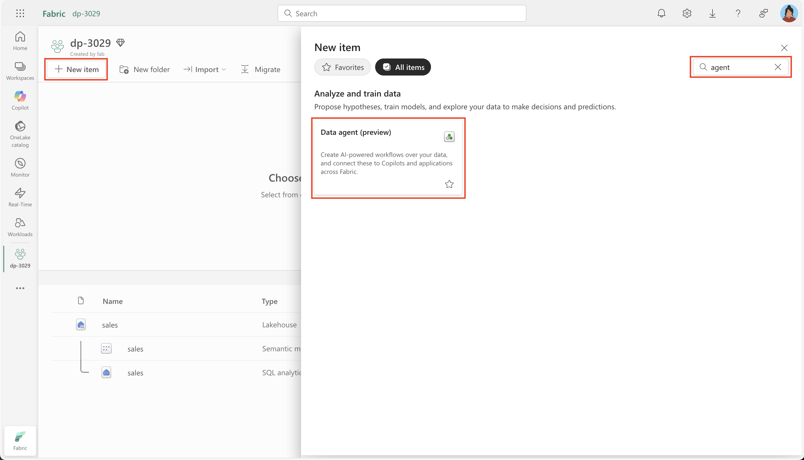
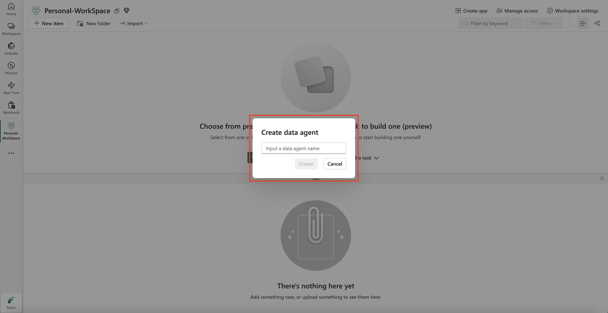
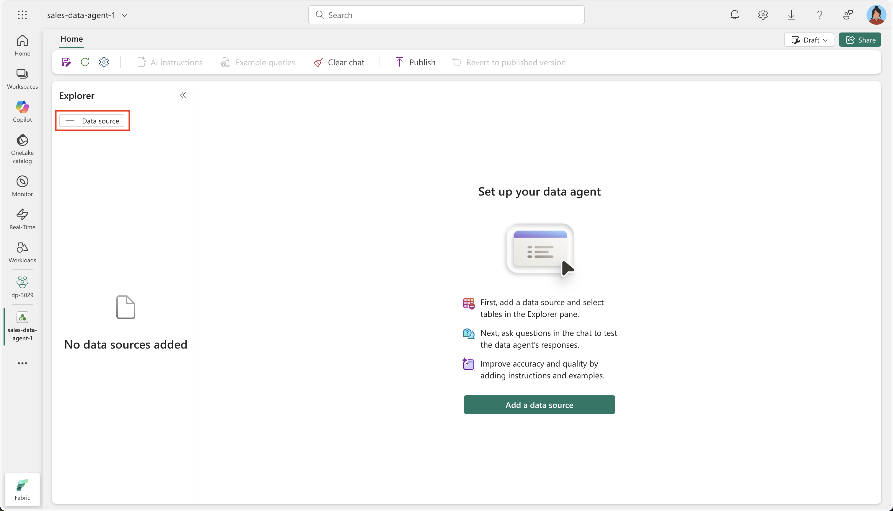

- [Chat with your data using Microsoft Fabric data agents](#chat-with-your-data-using-microsoft-fabric-data-agents)
  - [What you’ll learn](#what-youll-learn)
  - [Before you start](#before-you-start)
  - [Exercise scenario](#exercise-scenario)
  - [Create a Fabric Data Agent](#create-a-fabric-data-agent)
  - [Addtional Resources](#addtional-resources)

# Chat with your data using Microsoft Fabric data agents

A Microsoft Fabric data agent enables natural interaction with your data by allowing you to ask questions in plain English and receive structured, human-readable responses. By eliminating the need to understand query languages like SQL (Structured Query Language), DAX (Data Analysis Expressions), or KQL (Kusto Query Language), the data agent makes data insights accessible across the organization, regardless of technical skill level.

This exercise should take approximately less than **10** minutes to complete.

## What you’ll learn

By completing this lab, you will:

* Understand the purpose and benefits of Microsoft Fabric data agents for natural language data analysis.
* Learn how to create and configure a Fabric workspace and data warehouse.
* Gain hands-on experience loading and exploring a star schema sales dataset.
* See how data agents translate plain English questions into SQL queries.
* Develop skills to ask effective analytical questions and interpret AI-generated results.
* Build confidence in leveraging AI tools to democratize data access and insights.

## Before you start

You need a **Microsoft Fabric Capacity (F2 or higher)** with Copilot enabled to complete this exercise.

## Exercise scenario

We will create a sales data warehouse, load some data into it and then create a Fabric data agent. We will then ask it a variety of questions and explore how the data agent translates natural language into SQL queries to provide insights. This hands-on approach will demonstrate the power of AI-assisted data analysis without requiring deep SQL knowledge. Let’s start!

## Create a Fabric Data Agent

A Fabric data agent is an AI-powered assistant that can understand natural language questions about your data and automatically generate the appropriate queries to answer them. This eliminates the need for users to know SQL, KQL or DAX syntax while still providing accurate, data-driven insights. To create a new Fabric data agent, first navigate to your workspace, and then select the + New Item button. In the All items tab, search for Fabric data agent to locate the appropriate option, as shown in this screenshot:

Once selected, you're prompted to provide a name for your Fabric data agent. Give it a name like `nl2sqltaxi`:

Refer to the provided screenshot for a visual guide on naming the Fabric data agent. After entering the name, proceed with the configuration to align the Fabric data agent with your specific requirements.

Select Add a data source.

Choose the data warehouse you created earlier (NYC Taxi) and select the tables you want to include in the data agent's knowledge base. For this lab, select all the tables in the data warehouse.

> **Connecting to your data**: The data agent needs access to your tables to understand the schema and relationships. This allows it to generate accurate SQL queries based on your questions.

## Addtional Resources

1. [Create a Fabric data agent - Microsoft Fabric | Microsoft Learn](https://learn.microsoft.com/en-us/fabric/data-science/how-to-create-data-agent)